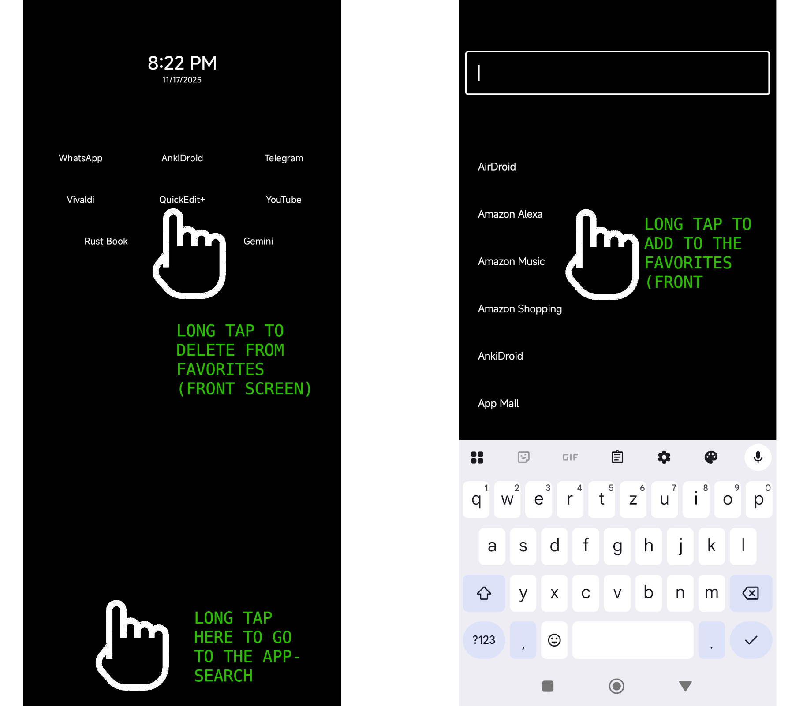

# Ultra Minimal Launcher

A simple, custom Android launcher application built with Jetpack Compose.

## Features

*   **Minimalist Home Screen:** A clean interface focusing on your favorite apps and the time.
*   **Digital Clock:** Displays the current time and date, respecting your device's locale for formatting.
*   **Favorite Apps:** Pin your most-used apps to the home screen for quick access.
*   **App Drawer:** Access a simple, searchable list of all your installed applications.
*   **Default Launcher Prompt:** If the app isn't your default launcher, it will gently remind you with a pulsating message. Tapping it will take you directly to the system settings to change it.

## Gesture Navigation & Shortcuts

*   **Swipe Up on Home Screen:** Opens the app drawer to see all your apps and add new favorites.
*   **Swipe Right on Home Screen:** Opens the camera app.
*   **Swipe Left on Home Screen:** Opens the phone/dialer app.
*   **Long Press on a Favorite App:** Opens a dialog to remove the app from your favorites.
*   **Tap on Clock:** Opens the default clock application.
*   **Double Tap on Clock:** Opens the timer or stopwatch.
*   **Long Press on Clock:** Opens the calendar application.

## How to Use

1.  Build and install the application on your Android device.
2.  Press the physical or virtual home button.
3.  Your device will ask you to select a default Home app.
4.  Choose "Ultra Minimal Launcher" from the list.

You will now see the Ultra Minimal Launcher home screen.

## Screenshot

